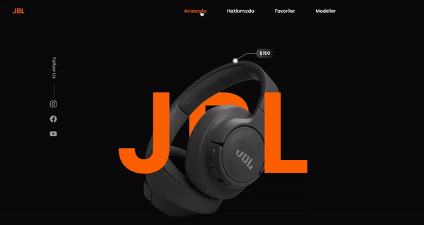

<h1> JBLclone </h1>

This project is designed to represent a website using HTML, Sass, and JavaScript technologies. The use of SCSS has made the CSS code more organized, readable, and manageable, enhancing the overall structure of the website.

<h2> The technologies used in the project </h2>

It was coded using HTML,SCSS and JavaScprit technologies.

<h2> screenshot </h2>

